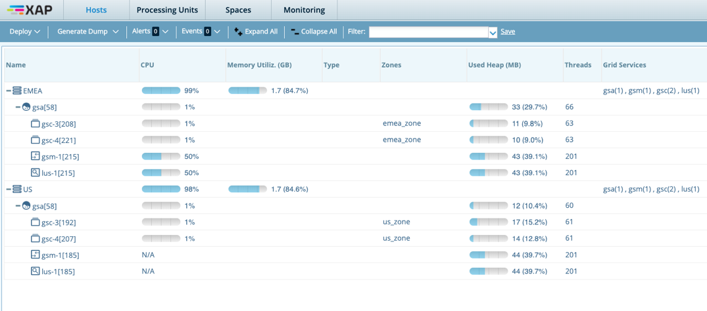
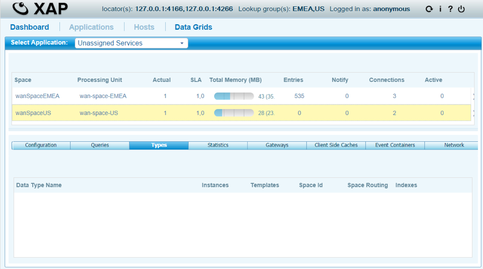
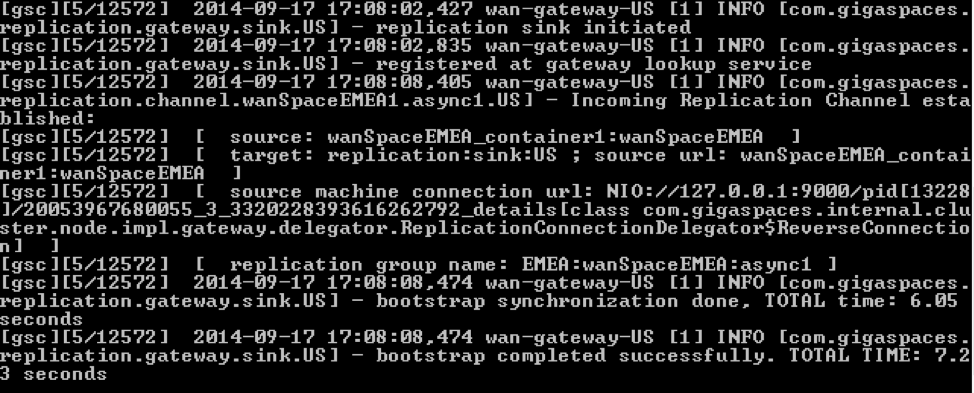
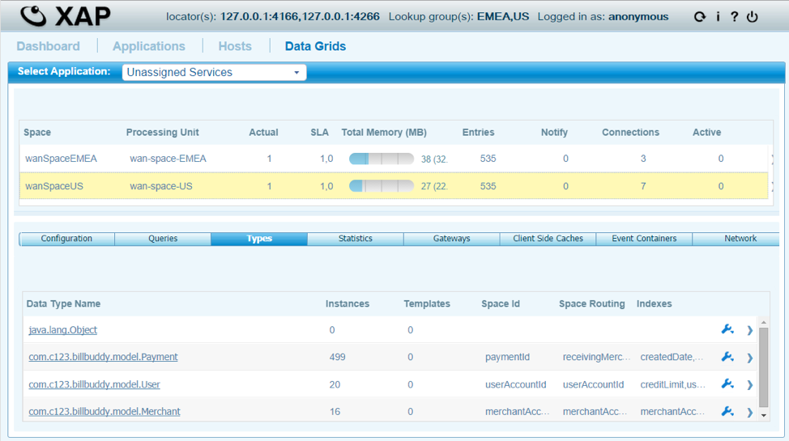
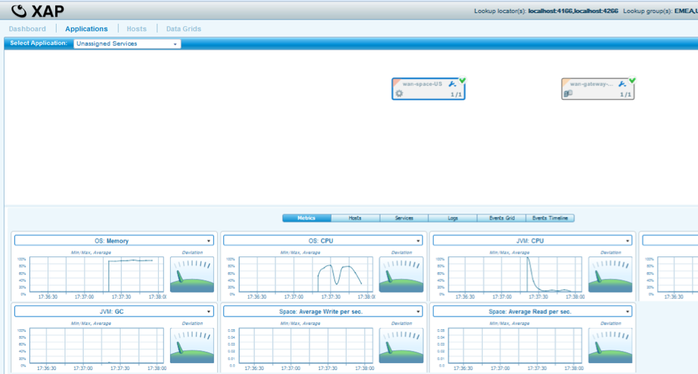
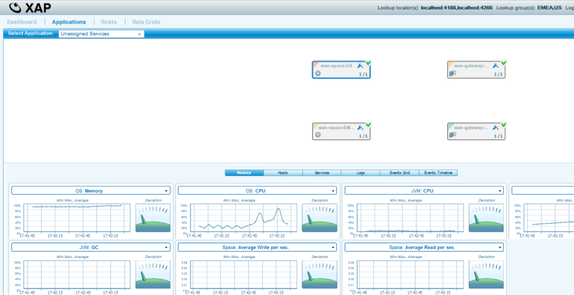
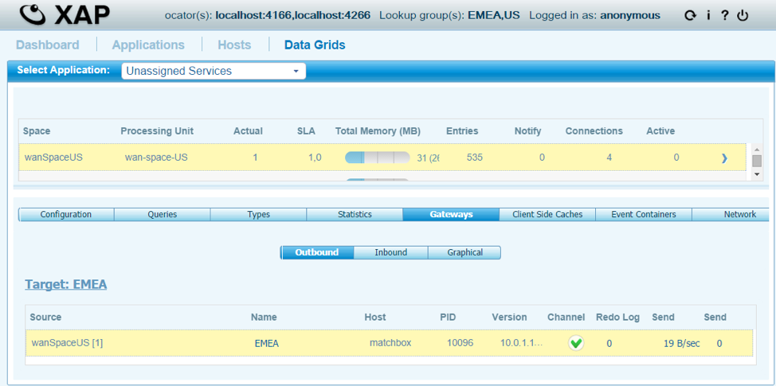
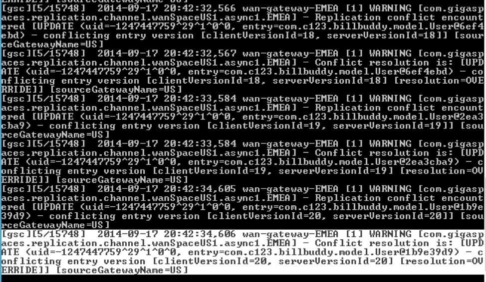

# Lab2-solution - wan gateway basics

## Lab Goals

1. Be introduced and gain basic experienced with WAN.  
2. Configure master slave and master to master over WAN gateway.  

## Lab Description
In this lab you will start XAP infrastructure services. You will configure the WAN Gateway Master-Slave setup. Deploy a WAN Gateway Master-Slave setup, preform writing into the master slave and observe the replication process to the slave space. You will use the GS-UI & GS-WEBUI to deploy & monitor the deployment. We will simulate 2 sites US and EMEA. In this case US site will serve as Master site.
Then we will configure EMEA to also be a Master site, deploy and test it.

## Lab setup
1.  Add GS_HOME system variable and point to Gigaspaces home directory:  
2.  Add export GS_WAN_TRAINING_HOME system variable and point to your WAN TRAINING directory:  

        vi ~/.bash_profile  
        export GS_HOME=~/XAP-Builds/gigaspaces-xap-enterprise-15.0.0
        export GS_WAN_TRAINING_HOME=~/XAPWANTraining
                               
3.  Make sure you restart gs-agent and gs-ui (or at least undeploy all Processing Units using gs-ui)
    
## 2.1	Clone and build the project lab

2.1.1 Create lab directory

    mkdir ~/XAPWANTraining/labs/lab2-solution
      
2.1.2 Clone the project from git
    
    cd ~/XAPWANTraining/labs/lab2-solution
    git clone https://github.com/GigaSpaces-ProfessionalServices/xap-wan-training.git 
    
2.1.3 Checkout lab2-solution
    
    cd xap-wan-training
    git checkout lab2-solution
    
2.1.4 Verify that the branch has been checked out.
    
    git branch
    * lab2-solution
      master 
    
2.1.5 Open xap-wan-training project with intellij  

#### Notice the following 4 modules in Intellij: ####

#### WanMasterSlaveTopology  #####
###### First part of the Lab exercise.  

#### WanMasterMasterTopology #####
###### Second part of the Lab exercise

#### BillBuddyModel #####
###### Defines all declarations that are required, in space side as well as the client application side.
###### This project should be deployed with all other projects since all other projects are dependent on the model.  

#### BillBuddyAccountFeeder #####
###### A client application (PU) that will be executed in Intellij. This application is responsible for writing Users and Merchants to the space.  

       
2.1.6 Run mvn install  

    yuval-pc:xap-wan-training yuval$ mvn install
    
    
       [INFO] ------------------------------------------------------------------------
       [INFO] Reactor Summary:
       [INFO] 
       [INFO] lab2-solution 1.0-SNAPSHOT ......................... SUCCESS [  0.701 s]
       [INFO] BillBuddyModel ..................................... SUCCESS [  4.888 s]
       [INFO] BillBuddyAccountFeeder 1.0-SNAPSHOT ................ SUCCESS [  1.971 s]
       [INFO] ------------------------------------------------------------------------
       [INFO] BUILD SUCCESS
       [INFO] ------------------------------------------------------------------------

## 2.2	Wan Master to Slave Topology Replication

Note: In this lab we use both gs-ui and gs-web-ui.  
Feel free to choose your favorite although for monitoring WAN gateway it is recommended you will use gs-webui.  
We will simulate a master slave topology using 2 sites: US which will serve as Master site and EMEA which will serve as Slave site.

     
 
   
   
###### NOTE: As this a solution lab, the next "TODO" parts already done for you.

2.1.1	Open project “WanMasterSlaveTopology”  
2.1.2	Define US Site Space  
&nbsp;  a.	Open deploy/wan-space-US/META-INF/spring/pu.xml  
&nbsp;  b.	Fix the TODO to add missing os-gateway:targets  
2.1.3	Define US Site Gateway  
&nbsp;  a.	Open deploy/wan-gateway-US/META-INF/spring/pu.xml  
&nbsp;  b.	Fix the TODO to add missing os-gateway:delegator  
2.1.4	Define EMEA Site Gateway  
&nbsp;  a.	Open deploy/wan-gateway-EMEA/META-INF/spring/pu.xml  
&nbsp;  b.	Fix the TODO to add missing os-gateway:sink  
2.1.5	Run the Grid for Examination  
Note: For all .bat/sh executions use the appropriate command window (cmd) or Linux terminal.   
&nbsp;  a.	Open CMD or Linux shell and change directory:  
 
    cd $GS_WAN_TRAINING_HOME/labs/lab2-solution/xap-wan-training/WanMasterSlaveTopology/scripts
  
   
&nbsp;  b.	Examine and Run /scripts/gs-ui.sh/bat and wait for GS-UI to start  
&nbsp;  c.	Examine and Run /scripts/master-slave-rep/cleanDeployFolder.sh/bat  
&nbsp;&nbsp;    that cleans any older deployments (Remember to do that any time you run your solution).   
&nbsp;  d.	Examine and Start the US Zone Agent  - run scripts/master-slave-rep/startAgent-US.bat  
&nbsp;  e.	Examine and Start the EMEA Zone Agent  - run scripts/master-slave-rep/startAgent-EMEA.bat  
&nbsp;  f.	Use gs-ui or gs-web-ui for validation that the grid for both US & EMEA zones is up and running.   

   
   
   g.	Deploy the US deployment (wan-space-US & wan-gateway-US), Run scripts/master-slave-rep/deployUS.bat
   h.	Validate the US Deployment

   
   
   i.	Deploy the EMEA deployment (wan-space-EMEA & wan-gateway-EMEA), Run scripts/master-slave-rep/deployEMEA.bat
   j.	Validate the EMEA Deployment
   
   
   
   k.	Populate information into US space to see it being replicated to the EMEA space – Run /WanMasterSlaveTopology/feeder/USfeeder.bat

   

l.	Validate that you can see the same amount of object in both spaces.
m.	Investigate specific object to make sure they are the same on both USspace & EMEA space using the Object Query

n.	View the WAN Gateway view in the web-UI 

   
   
   o.	View the WAN Gateway outbound in the web-UI 
   
   
   
   p.	Rerun the USfeeder while viewing the gateway outbound stats above and see if you get redo log stats and traffic stats
   
    