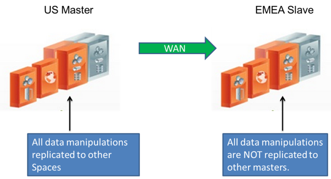
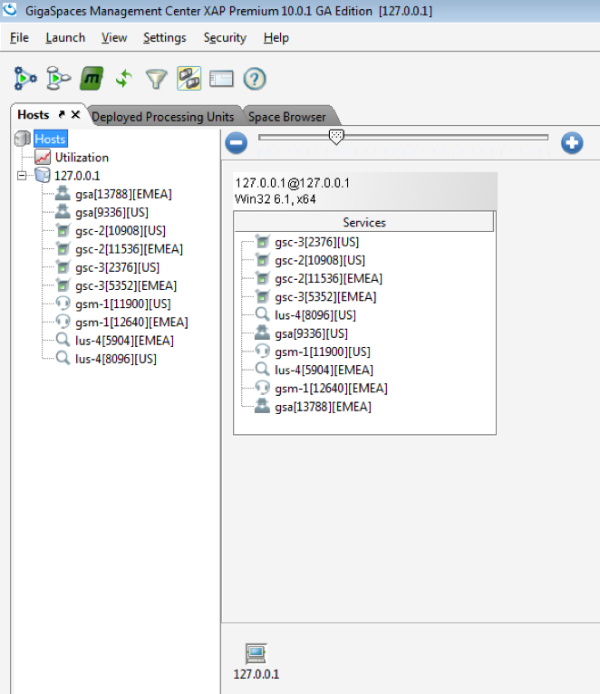
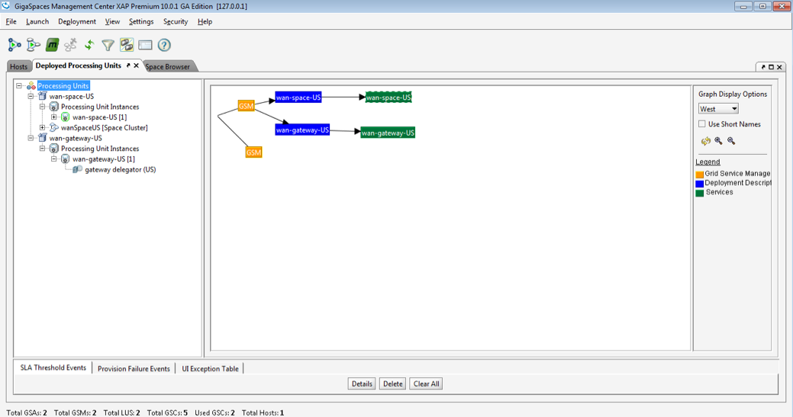
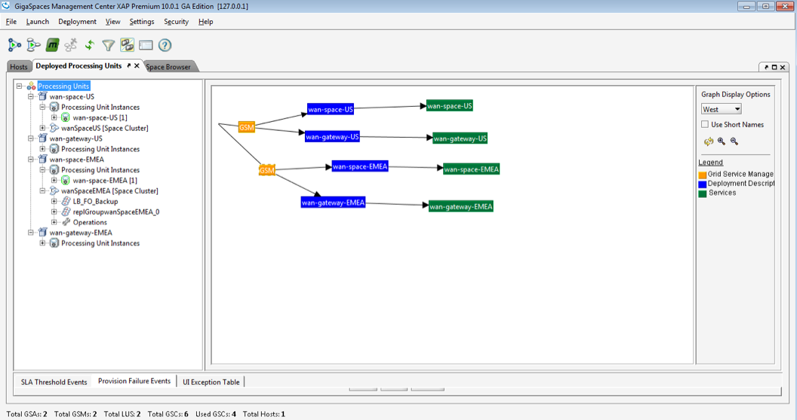
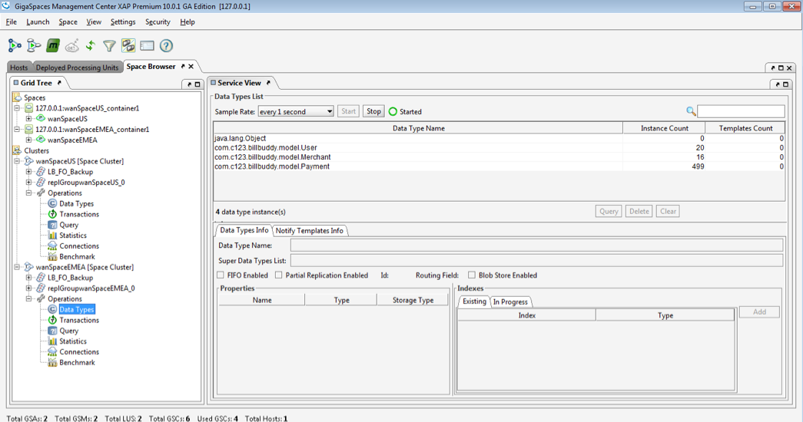
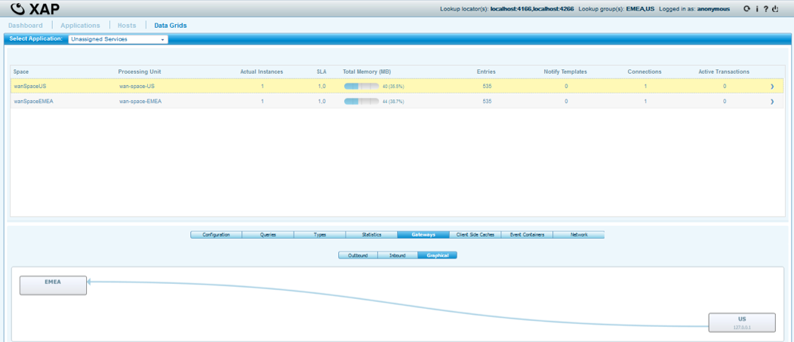
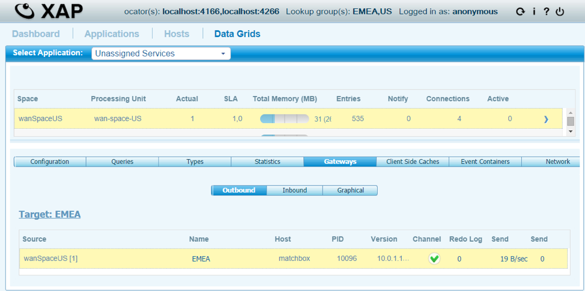
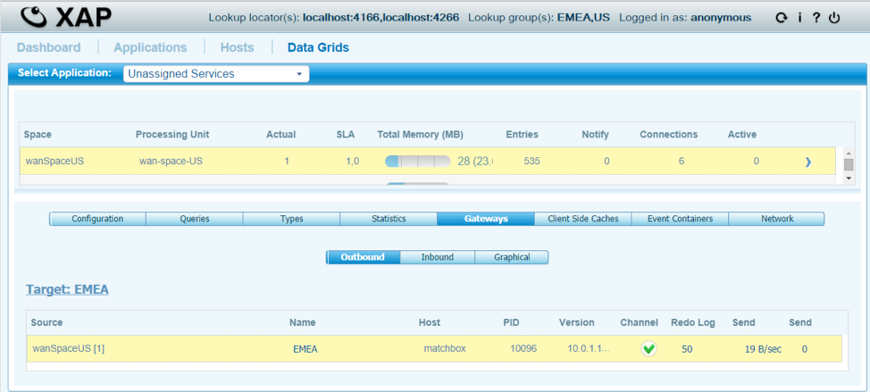

# lab01-active_passive

This lab covers the WAN Gateway active-passive topology: two sites, US and EMEA, connected by one-directional replication. The whole grid runs as Docker containers. This is a solution lab, so everything described below is already implemented and working.

## Lab Goals

- Get familiar with the WAN Gateway active-passive topology.
- Deploy the topology in Docker, feed data into the active site, and confirm it replicates to the passive site.

## Lab Description

US is the active site: writes land there and replicate out to EMEA. EMEA is the passive site: it only ever receives replicated data and never delegates anything back. Replication is strictly one-directional, US to EMEA.



## Prerequisites

- Docker and Docker Compose v2
- The `gigaspaces/smart-cache-enterprise:17.3.0` image
- Maven, to build the reactor's modules

## Topology

Six containers total, three per site: a manager, a space-GSC container running all four space GSCs (2 partitions x 1 backup), and a dedicated gateway-GSC.

```
 wan-net (172.28.0.0/16), one flat network
 ┌──────────────────────────────┐           ┌───────────────────────────────┐
 │ us-manager    172.28.1.10    │           │ emea-manager   172.28.2.10    │
 │ us-space-gsc  172.28.1.21    │           │ emea-space-gsc 172.28.2.21    │
 │ us-gateway-gsc 172.28.1.30  ──delegator──▶ 172.28.2.30  emea-gateway-gsc │
 │   (delegator only, no sink)  │           │   (sink only, no delegator)   │
 └──────────────────────────────┘           └───────────────────────────────┘
```

US's gateway only has a delegator; EMEA's only has a sink. Because the two sides are structurally asymmetric this way, the space and gateway roles are each their own dedicated module per site rather than one shared module deployed twice. See the Notes section below for the implementation rationale.

## Module structure

- `BillBuddyModel` - shared domain classes (`User`, `Merchant`, `Payment`) used by every other module.
- `BillBuddyAccountFeeder` - a standalone client that writes users, merchants, and payments into a space.
- `BillBuddySpaceUS` - the active space; has `gateway-targets` and delegates to EMEA.
- `BillBuddySpaceEMEA` - the passive space; a plain space with no `gateway-targets`, receive-only.
- `BillBuddyGatewayUS` - the WAN gateway delegator for US.
- `BillBuddyGatewayEMEA` - the WAN gateway sink for EMEA.

All six live in this lab's own standalone Maven reactor. `BillBuddyModel` and `BillBuddyAccountFeeder` are duplicated here rather than shared with `lab02-active_active`, matching how each lab in this training set is independently self-contained.

## Build and run it

```bash
# 1. Build the reactor
mvn install

# 2. Bring up both sites' grids and deploy the space/gateway PUs
cd docker
docker compose up -d
docker compose logs -f us-deployer emea-deployer

# 3. Feed data into US and watch it replicate to EMEA
docker compose --profile feeder run --rm us-feeder
```

## Verify replication

```bash
docker run --rm --network docker_wan-net --entrypoint /bin/bash \
  gigaspaces/smart-cache-enterprise:17.3.0 -c \
  "/opt/gigaspaces/bin/gs.sh --server=emea-manager space query wanSpaceEMEA \
   com.gigaspaces.training.billbuddy.model.Payment --max-results=2000 --columns=paymentId"
```

EMEA should show the same records US was fed. There is no reverse-direction feeder: EMEA has no delegator, so nothing ever replicates back to US.

- US manager REST V3 API / Swagger UI: http://localhost:19090/api/v3/swagger-ui/index.html
- EMEA manager REST V3 API / Swagger UI: http://localhost:29090/api/v3/swagger-ui/index.html

These ports collide with `lab02-active_active`'s if both stacks run at the same time; bring up only one topology at a time, or remap ports in one of the two `docker-compose.yaml` files.

## Screenshots from the original run

This lab originally ran bare-metal, monitored through GigaSpaces' GS-UI and GS-WEBUI desktop/web consoles instead of the CLI and REST V3 Swagger UI the Docker version uses today. Those consoles are not part of the current setup, but the screenshots below are kept as a reference: they show the same topology and, in one case, the exact same data counts this lab still produces.

Both sites' grid up and registered, viewed through GS-UI's Hosts tab:  


US deployed (`wan-space-US`, `wan-gateway-US`):  


Both sites deployed (`wan-space-US`/`wan-gateway-US` and `wan-space-EMEA`/`wan-gateway-EMEA`):  


Data fed into US and browsed through GS-UI's Space Browser: 20 `User`, 16 `Merchant`, and 499 `Payment` objects, the same counts the Docker version above produces:  


The WAN gateway link between the two sites, viewed through GS-WEBUI's Gateways tab:  


Outbound replication stats before and after re-feeding US: redo log goes from 0 to 50 as the new writes queue up for replication to EMEA.  



## Tear down

```bash
docker compose down -v
```

## Notes

See [docker/build-notes.md](docker/build-notes.md) for the implementation rationale behind this lab's Docker setup: why the network is flat rather than segmented, why the space and gateway roles are separate Maven modules instead of one shared module per role, and how each one gets packaged for Docker.
