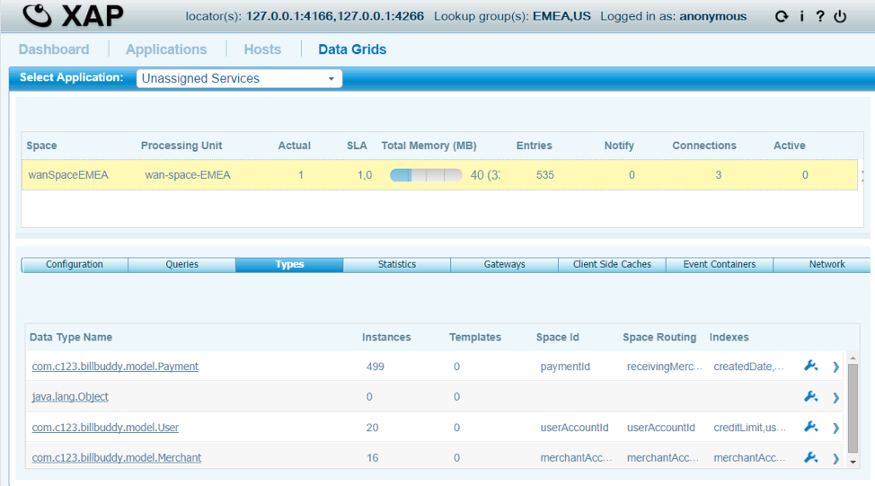
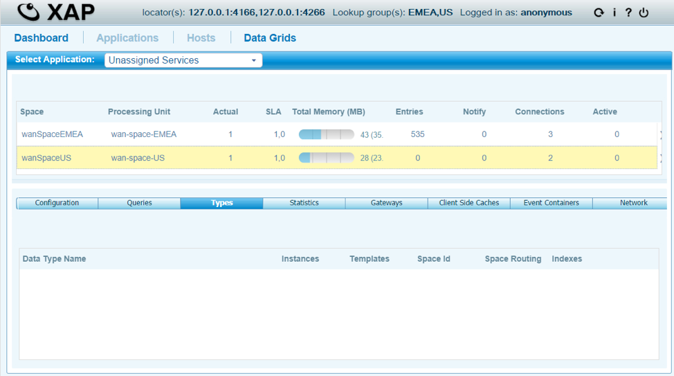
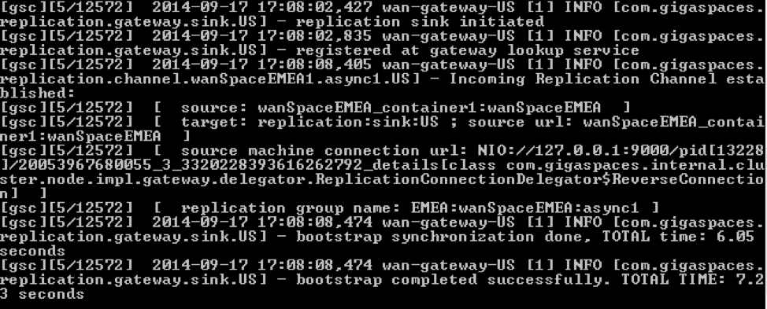
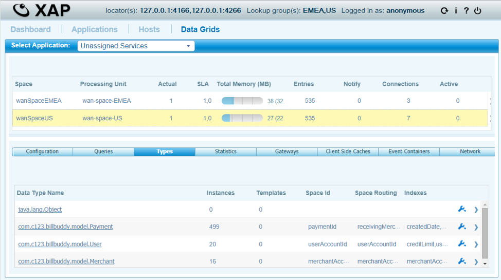

# lab03-wan_bootstrap-exercise - WAN Bootstrapping

A site taken down for extended maintenance, or a new site added after the other has been running for a while, can fall too far behind for ordinary replication to close the gap. WAN bootstrapping handles that case by pulling the other site's existing dataset in with one explicit call, then handing off to normal replication for everything after.

## Lab Goals

- Get familiar with WAN Gateway bootstrapping.
- Deploy EMEA first, feed it data, then deploy US and confirm it starts out empty despite an active gateway connection.
- Trigger the bootstrap and confirm US ends up with exactly EMEA's data, then confirm ongoing replication keeps working afterward.

## This is an exercise lab

Two pieces are deliberately left for you to complete -- everything else here (module structure, Docker setup, deploy order) is already working:

- `BillBuddyGateway/src/main/resources/META-INF/spring/pu.xml` -- the sink bean is missing the `requiresBootstrap` property wiring. Search for `TODO` in this file.
- `AdminBootStrap/src/main/java/com/gigaspaces/wan/training/bootstrap/AdminBootstrapInitiator.java` -- four TODOs: obtaining the `Admin` instance, waiting for the US gateway, waiting for it to connect to EMEA's sink, and starting the bootstrap itself. Search for `TODO` in this file.

Until both are filled in, US's gateway sink never actually blocks on bootstrap (the property never reaches the sink bean) and `AdminBootstrapInitiator` won't compile into something that does anything -- the rest of the lab (build, deploy, feed) works regardless, so you can follow the steps below and watch what's still missing before fixing it.

## Lab Description

EMEA is deployed and fed first, entirely on its own. US is deployed afterward with its gateway sink marked `requires-bootstrap="true"`, so it does not pick up EMEA's existing data through normal replication. An `AdminBootstrapInitiator` client connects to US's gateway and explicitly pulls EMEA's data in. Both sites otherwise run a full delegator and sink, so once bootstrapping is done, replication continues normally in both directions.

## Prerequisites

- Docker and Docker Compose v2
- The `gigaspaces/smart-cache-enterprise:17.3.0` image
- Maven, to build the reactor's modules

## Topology

Order matters here more than in any other lab in this training set. US's grid services are profile-gated behind `"us"` and do not start with a plain `docker compose up -d`, since the whole point of the lab is the staged boot order below.

```
 wan-net (172.28.0.0/16), one flat network
 ┌──────────────────────────────┐    ┌─────────────────────────────────┐
 │ (profile "us")               │    │ (default - always up)           │
 │ us-manager    172.28.1.10    │    │ emea-manager   172.28.2.10      │
 │ us-space-gsc  172.28.1.21    │    │ emea-space-gsc 172.28.2.21      │
 │ us-gateway-gsc 172.28.1.30 ──┼────┼── 172.28.2.30  emea-gateway-gsc │
 │  requires-bootstrap=true     │    │  requires-bootstrap=false       │
 └──────────────────────────────┘    └─────────────────────────────────┘
```

Both gateways run a full delegator and sink; the only real difference between them is the `requiresBootstrap` flag, passed as a `-p` override at deploy time -- once you've wired it up.

## Module structure

- `BillBuddyModel` - shared domain classes (`User`, `Merchant`, `Payment`) used by every other module.
- `BillBuddyAccountFeeder` - a standalone client that writes users, merchants, and payments into a space.
- `BillBuddySpace` - the space module, deployed once per site with `-p` overrides for the site-specific space name and gateway targets.
- `BillBuddyGateway` - the WAN gateway module (delegator and sink), deployed once per site; the sink's `requiresBootstrap` property is the one value that should differ between the two deployments, once wired up.
- `AdminBootStrap` - a one-shot admin client (`AdminBootstrapInitiator`), not a Processing Unit. It's meant to wait for US's gateway to connect to EMEA, then trigger the bootstrap and exit.

All five live in this lab's own standalone Maven reactor. `BillBuddyModel` and `BillBuddyAccountFeeder` are duplicated here rather than shared with the other labs in this training set, matching how each one is independently self-contained.

## Build and run it

```bash
# 1. Build the reactor
mvn install

# 2. Bring up EMEA only
cd docker
docker compose up -d
docker compose logs -f emea-deployer   # wait for "EMEA deployment complete."

# 3. Feed EMEA
docker compose --profile feeder run --rm emea-feeder

# 4. Bring up US (should be empty at this point once requires-bootstrap is wired up)
docker compose --profile us up -d
docker compose logs -f us-deployer     # wait for "US deployment complete."

# 5. Bootstrap US from EMEA
docker compose --profile bootstrap run --rm bootstrap-initiator
```

## Verify bootstrap and replication

Once both TODOs are filled in: before step 5, `wanSpaceUS` should have 0 objects even though the gateway PU is `INTACT` and connected, confirming `requires-bootstrap="true"` genuinely blocks automatic replication rather than being a no-op flag. After step 5, `wanSpaceUS` should have exactly the same record counts as `wanSpaceEMEA`.

```bash
docker run --rm --network docker_wan-net --entrypoint /bin/bash \
  gigaspaces/smart-cache-enterprise:17.3.0 -c \
  "/opt/gigaspaces/bin/gs.sh --server=us-manager space info --type-stats wanSpaceUS"
```

To confirm ongoing replication survives the bootstrap, feed US again and check both sides converge:

```bash
docker compose --profile feeder run --rm us-feeder
```

- US manager REST V3 API / Swagger UI: http://localhost:19090/api/v3/swagger-ui/index.html
- EMEA manager REST V3 API / Swagger UI: http://localhost:29090/api/v3/swagger-ui/index.html

## Tear down

Plain `docker compose down -v` only removes default-profile services (the EMEA side) - the US and bootstrap services are profile-gated and survive it. Tear down with every profile active:

```bash
docker compose --profile us --profile feeder --profile bootstrap down -v
```

## Notes

See [docker/build-notes.md](docker/build-notes.md) for the implementation rationale behind this lab's Docker setup: why the gateway sink is a plain Spring bean rather than `<os-gateway:sink>` (relevant to the `requiresBootstrap` TODO above), how `AdminBootStrap` is built and packaged, and why a couple of services skip `depends_on`. This lab also reuses `lab02-active_active`'s grid-level design (flat network, shared modules deployed twice); see [lab02-active_active/docker/build-notes.md](../lab02-active_active/docker/build-notes.md) for that.

## Screenshots from the original run

This lab originally ran bare-metal, monitored through GigaSpaces' GS-WEBUI web console instead of the CLI and REST V3 Swagger UI the Docker version uses today. That console is not part of the current setup, but the screenshots below are kept as a reference: they show the same bootstrap checkpoints, and the exact same data counts this lab still produces once the TODOs are completed.

EMEA fed and holding data, before US is ever started:  


US deployed but still empty, despite its gateway being connected to EMEA:  


The bootstrap running to completion, from the gateway's own log output:  


Both sides converged after the bootstrap, US now matching EMEA's 499/20/16 counts:  

