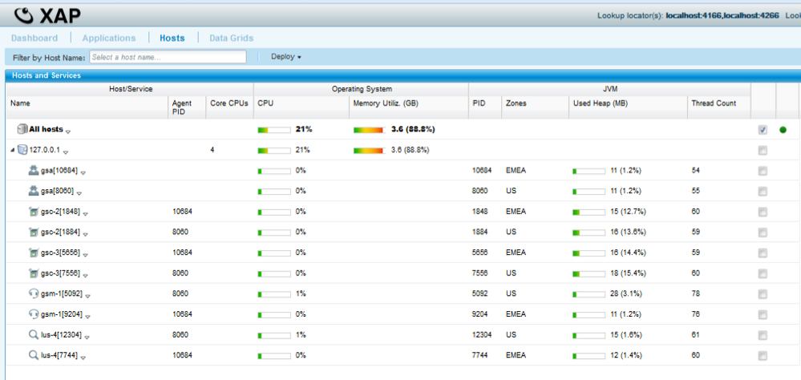
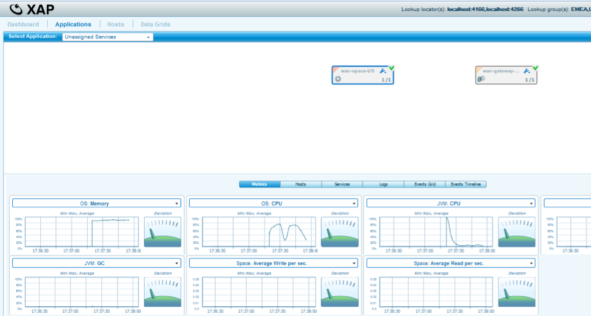

# lab04-wan_gateway_filter-solution - WAN Gateway Filter

Not every record belongs on every continent. Data residency rules, or simply the cost of shipping data that a remote site will never use, often mean only a subset of what's written at one site should replicate to another. WAN Gateway replication filters let a site decide that on a per-object basis, instead of replicating everything indiscriminately.

## Lab Goals

- Get familiar with WAN Gateway replication filters.
- Deploy the active-active topology in Docker, feed US with a mix of users from every continent, and confirm only the Europe subset replicates to EMEA.

## Lab Description

`ReplicationFilter` is attached to US's space and inspects every `User` object about to replicate to EMEA. It discards the write unless the user's `location` is `Continent.Europe`; every other object type, and everything replicating in the EMEA to US direction, is unaffected. Both sites otherwise run a full delegator and sink, so this is bidirectional active-active replication with one direction selectively filtered.

## Prerequisites

- Docker and Docker Compose v2
- The `gigaspaces/smart-cache-enterprise:17.3.0` image
- Maven, to build the reactor's modules

## Topology

Six containers total, three per site: a manager, a space-GSC container running all four space GSCs (2 partitions x 1 backup), and a dedicated gateway-GSC.

```
 wan-net (172.28.0.0/16), one flat network
 ┌───────────────────────────────┐    ┌─────────────────────────────────┐
 │ us-manager    172.28.1.10     │    │ emea-manager   172.28.2.10      │
 │ us-space-gsc  172.28.1.21     │    │ emea-space-gsc 172.28.2.21      │
 │  (filter attached)            │    │  (no filter)                    │
 │ us-gateway-gsc  172.28.1.30 ──┼────┼── 172.28.2.30  emea-gateway-gsc │
 └───────────────────────────────┘    └─────────────────────────────────┘
```

The gateway PU has no asymmetry between sites, so it's one shared `BillBuddyGateway` module deployed twice. The space PU does: US carries the filter bean, EMEA doesn't, which is a structural difference (an entire extra bean and element present only on one side, not just a different value), so the space PU is two separate modules rather than one shared one. See the Notes section below for the implementation rationale.

## Module structure

- `BillBuddyModel` - shared domain classes (`User`, `Merchant`, `Payment`) used by every other module.
- `BillBuddyAccountFeeder` - a standalone client that writes users, merchants, and payments into a space.
- `ReplicationFilter` - the filter implementation, attached only to US's space. `process()` discards any `User` write bound for EMEA unless `location == Continent.Europe`.

  

- `BillBuddySpaceUS` - the space module carrying the filter, wired in via `<os-core:space-replication-filter>`.

  

- `BillBuddySpaceEMEA` - the space module with no filter.
- `BillBuddyGateway` - the WAN gateway module (delegator and sink), deployed once per site with `-p` overrides.

All six live in this lab's own standalone Maven reactor. `BillBuddyModel` and `BillBuddyAccountFeeder` are duplicated here rather than shared with the other labs in this training set, matching how each one is independently self-contained.

## Build and run it

```bash
# 1. Build the reactor
mvn install

# 2. Bring up both sites' grids and deploy the space/gateway PUs
cd docker
docker compose up -d
docker compose logs -f us-deployer emea-deployer
```






```bash
# 3. Feed US with a random mix of continents
docker compose --profile feeder run --rm us-feeder
```

## Verify the filter

EMEA should only have the Europe subset of the Users fed into US; every other object type replicates in full.

```bash
docker run --rm --network docker_wan-net --entrypoint /bin/bash \
  gigaspaces/smart-cache-enterprise:17.3.0 -c \
  "/opt/gigaspaces/bin/gs.sh --server=emea-manager space query wanSpaceEMEA \
   com.gigaspaces.training.billbuddy.model.User --max-results=50 --columns=userAccountId,location"
```


- US manager REST V3 API / Swagger UI: http://localhost:19090/api/v3/swagger-ui/index.html
- EMEA manager REST V3 API / Swagger UI: http://localhost:29090/api/v3/swagger-ui/index.html

## Tear down

```bash
docker compose down -v
```

## Notes

See [docker/build-notes.md](docker/build-notes.md) for the implementation rationale behind this lab's Docker setup: why `BillBuddySpaceUS`/`BillBuddySpaceEMEA` are two separate modules instead of one shared one, and how `ReplicationFilter` is built and bundled. This lab also reuses `lab02-active_active`'s grid-level design (flat network, `BillBuddyGateway` as a shared module deployed twice); see [lab02-active_active/docker/build-notes.md](../lab02-active_active/docker/build-notes.md) for that.
