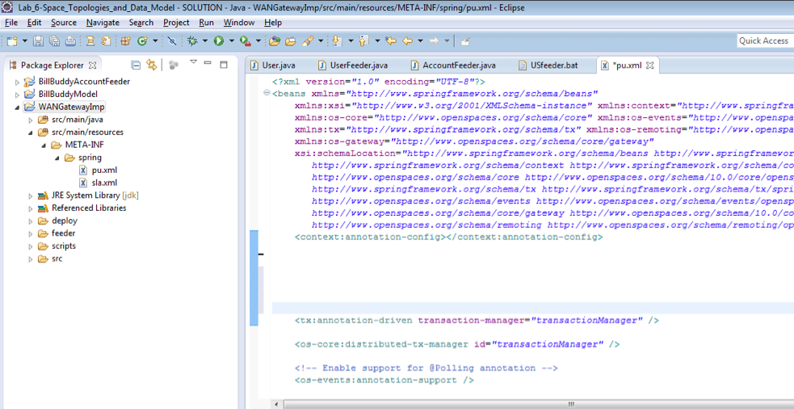
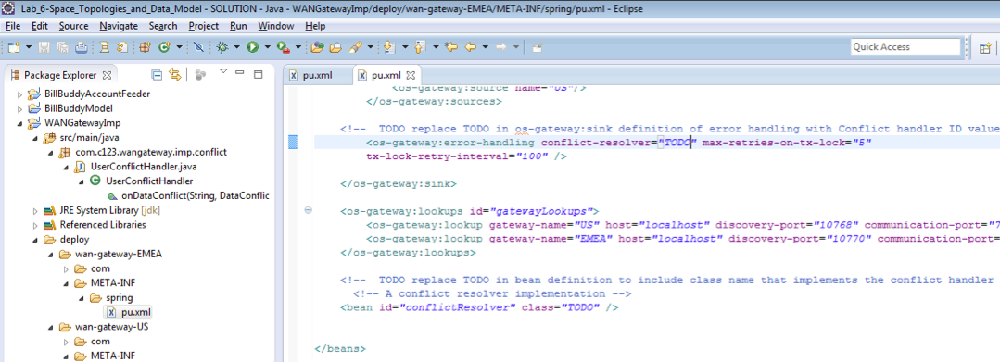
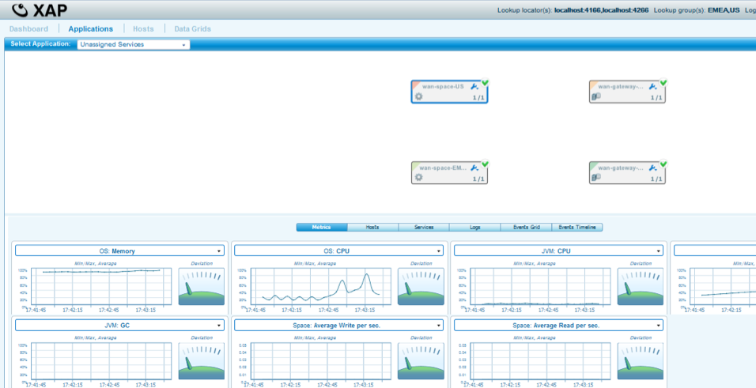
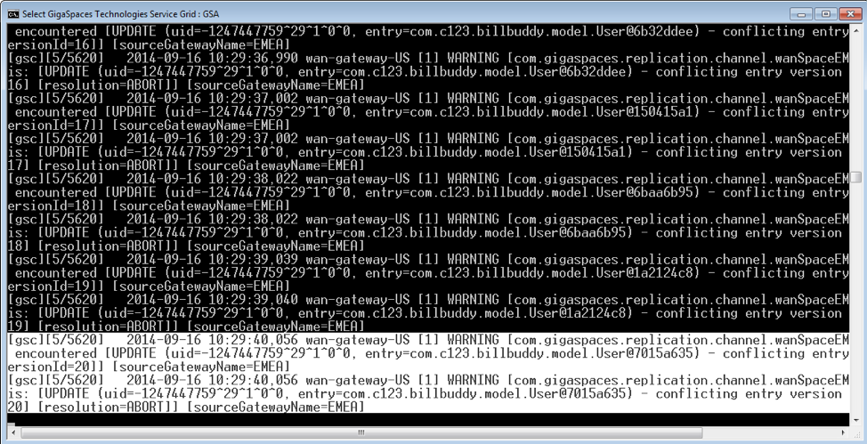
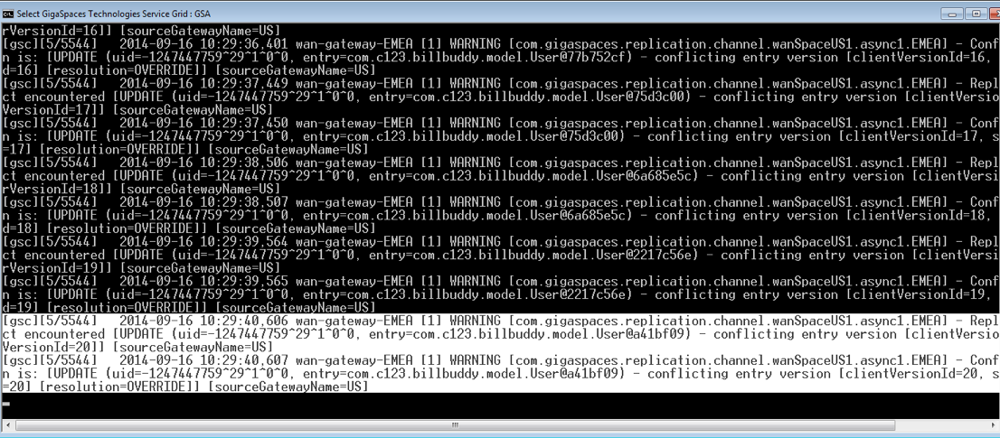

# lab05-wan_gateway_conflict-exercise - WAN Gateway Conflict Resolution

Two sites that operated independently before a WAN link connected them, whether during a network partition or before the link was even set up, can end up with different values for the same record. Without an explicit policy for which value wins, the two sites silently overwrite each other's data the moment they reconnect. This lab shows how a conflict handler makes that outcome deterministic instead of a coin flip.

## Lab Goals

- Configure and understand a WAN Gateway conflict resolution handler.
- Deploy the topology in Docker, force a genuine conflict, and observe how it resolves.

## This is an exercise lab

Two pieces are deliberately left for you to complete -- everything else here (module structure, Docker setup, deploy order) is already working:

- `ConflictResolution/src/main/java/.../UserConflictHandler.java` -- `onDataConflict()` is empty. Search for `TODO` in this file: conflicts sourced from EMEA should be discarded, and conflicts sourced from US should always override the local EMEA value.
- `BillBuddyGateway/src/main/resources/META-INF/spring/pu.xml` -- the conflict resolver bean's `class` and the `<os-gateway:error-handling>` element's `conflict-resolver` attribute are both left as the placeholder value `TODO`. Search for `TODO` in this file and wire them to the real bean.

Until both are filled in, the gateway PU won't deploy (Spring can't resolve a class literally named `TODO`), so fix these before step 4 below -- steps 1-3 (build, space-only deploy, feed) work regardless and are worth running first to see the "no gateway link yet" state for yourself.

## Lab Description

`UserConflictHandler` should decide how to reconcile a `User` record that both sites wrote independently before they were ever connected. The intended policy: conflicts sourced from EMEA are discarded, and conflicts sourced from US always override the local EMEA value, so US consistently wins.

To make this deterministic rather than a timing race, the space and gateway PUs deploy in two separate stages. EMEA and US both deploy their space PU first, with no gateway link at all, and are fed independently, so each ends up with its own version of the same 20 `User` records. Only then do the gateway PUs deploy; the moment they connect, each side's already-built-up redo log drains into the other, producing a real conflict for every one of those 20 records.

## Prerequisites

- Docker and Docker Compose v2
- The `gigaspaces/smart-cache-enterprise:17.3.0` image
- Maven, to build the reactor's modules

## Topology

Six containers total, three per site: a manager, a space-GSC container running all four space GSCs (2 partitions x 1 backup), and a dedicated gateway-GSC. US's grid services are the same as EMEA's; nothing is profile-gated here, since both sites need to exist before feeding them.

```
 wan-net (172.28.0.0/16), one flat network
 ┌──────────────────────────────┐    ┌─────────────────────────────────┐
 │ us-manager    172.28.1.10    │    │ emea-manager   172.28.2.10      │
 │ us-space-gsc  172.28.1.21    │    │ emea-space-gsc 172.28.2.21      │
 │ us-gateway-gsc 172.28.1.30 ──┼────┼── 172.28.2.30  emea-gateway-gsc │
 └──────────────────────────────┘    └─────────────────────────────────┘
```

`UserConflictHandler` should branch on the incoming source gateway's name internally, so the identical bean and `<os-gateway:error-handling>` element appear on both sites' gateway PU - it's one shared `BillBuddyGateway` module deployed twice. The space PU has no asymmetry either, so it's one shared `BillBuddySpace` module too. See the Notes section below for the implementation rationale.

## Module structure

- `BillBuddyModel` - shared domain classes (`User`, `Merchant`, `Payment`) used by every other module.
- `BillBuddyAccountFeeder` - a standalone client that writes users, merchants, and payments into a space.
- `ConflictResolution` - `UserConflictHandler`, which should implement `onDataConflict()` -- one of the two TODOs above.

  

- `BillBuddySpace` - the space module, deployed once per site with `-p` overrides for the site-specific space name and gateway targets.
- `BillBuddyGateway` - the WAN gateway module (delegator, sink, and the conflict resolver bean), deployed once per site with `-p` overrides -- the other TODO above.

  
  

All five live in this lab's own standalone Maven reactor. `BillBuddyModel` and `BillBuddyAccountFeeder` are duplicated here rather than shared with the other labs in this training set, matching how each one is independently self-contained.

## Build and run it

Order matters here more than in any other lab in this training set.

```bash
# 1. Build the reactor
mvn install

# 2. Bring up the grid, deploy the SPACE PUs only
cd docker
docker compose up -d
docker compose logs -f us-space-deployer emea-space-deployer
```


```bash
# 3. Feed both sites independently, with no gateway link yet
docker compose --profile feeder run --rm us-feeder
docker compose --profile feeder run --rm emea-feeder
```




```bash
# 4. Deploy the GATEWAY PUs - this is when conflicts should surface and resolve,
#    once both TODOs above are filled in
docker compose --profile gateway up -d
```

## Verify the resolution

Once both TODOs are filled in: grep both gateways' logs for the resolution outcome. US should show `ABORT` for every EMEA-sourced conflict; EMEA should show `OVERRIDE` for every US-sourced conflict.

```bash
docker compose logs us-gateway-gsc emea-gateway-gsc | grep -i resolution
```





Every `User` record on both sides should then match US's original values.

```bash
docker run --rm --network docker_wan-net --entrypoint /bin/bash \
  gigaspaces/smart-cache-enterprise:17.3.0 -c \
  "/opt/gigaspaces/bin/gs.sh --server=us-manager space query wanSpaceUS \
   com.gigaspaces.training.billbuddy.model.User --max-results=50 --columns=userAccountId,location"
```

- US manager REST V3 API / Swagger UI: http://localhost:19090/api/v3/swagger-ui/index.html
- EMEA manager REST V3 API / Swagger UI: http://localhost:29090/api/v3/swagger-ui/index.html

## Tear down

Plain `docker compose down -v` only removes default-profile services (the space side) - the gateway deployers are profile-gated and survive it. Tear down with every profile active:

```bash
docker compose --profile feeder --profile gateway down -v
```

## Notes

See [docker/build-notes.md](docker/build-notes.md) for the implementation rationale behind this lab's Docker setup: why the space and gateway deploy steps are split into separate deployers, and why `BillBuddyGateway` needs an assembly plugin here unlike the other labs. This lab also reuses `lab02-active_active`'s grid-level design (flat network, shared modules deployed twice); see [lab02-active_active/docker/build-notes.md](../lab02-active_active/docker/build-notes.md) for that.
