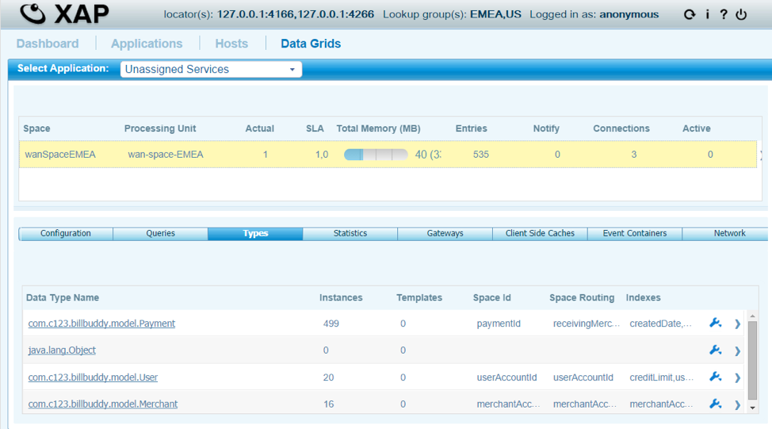
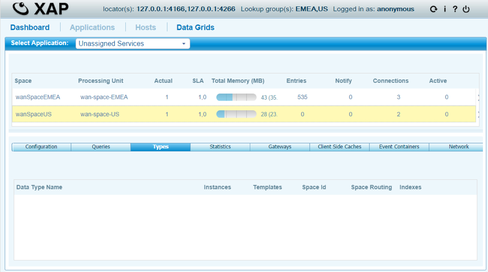
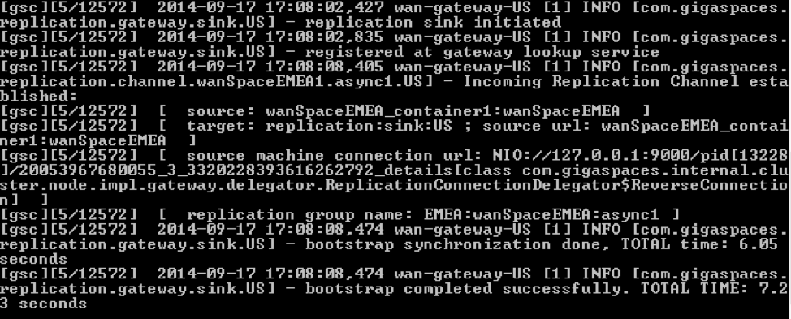
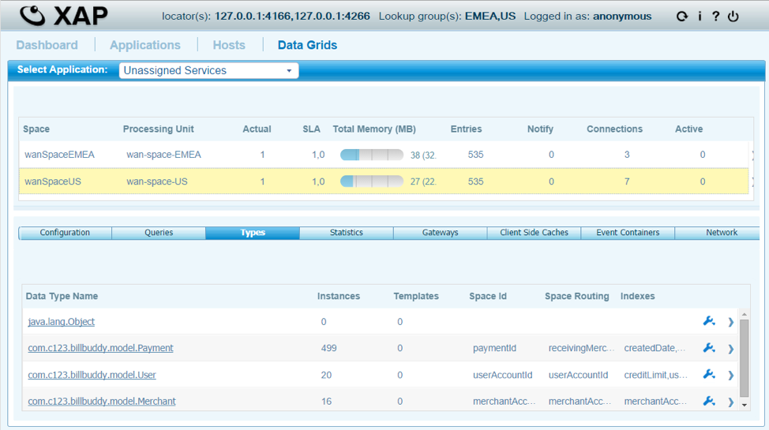

# lab3-solution - WAN Bootstrapping

## Lab Goals
Configure WAN bootstrapping  

## Lab Description
In this lab you already have the Master to Master configuration setup  
but this time you will start EMEA site only and use its feeder to add data to it.   
Only after the feeder has ended its execution you will start the US site  
and configure it to bootstrap itself from the EMEA site.  

## Lab setup
1.  Add GS_HOME system variable and point to Gigaspaces home directory:  
2.  Add export GS_WAN_TRAINING_HOME system variable and point to your WAN TRAINING directory:  

        vi ~/.bash_profile  
        export GS_HOME=~/XAP-Builds/gigaspaces-xap-enterprise-15.0.0
        export GS_WAN_TRAINING_HOME=~/XAPWANTraining
                               
3.  Make sure you restart gs-agent and gs-ui (or at least undeploy all Processing Units using gs-ui)
    
## 2.1	Build the project lab

2.1.1 Open xap-wan-training project with intellij  

#### Notice the following 3 modules in Intellij: ####

#### WanMasterMasterBootstrap #####
###### Second part of the Lab exercise

#### BillBuddyModel #####
###### Defines all declarations that are required, in space side as well as the client application side.
###### This project should be deployed with all other projects since all other projects are dependent on the model.  

#### BillBuddyAccountFeeder #####
###### A client application (PU) that will be executed in Intellij. This application is responsible for writing Users and Merchants to the space.  

       
2.1.2 Run mvn install  

    yuval-pc:xap-wan-training yuval$ mvn install
    
    
       [INFO] ------------------------------------------------------------------------
       [INFO] Reactor Summary:
       [INFO] 
       [INFO] lab3-solution 1.0-SNAPSHOT ......................... SUCCESS [  0.701 s]
       [INFO] BillBuddyModel ..................................... SUCCESS [  4.888 s]
       [INFO] BillBuddyAccountFeeder 1.0-SNAPSHOT ................ SUCCESS [  1.971 s]
       [INFO] ------------------------------------------------------------------------
       [INFO] BUILD SUCCESS
       [INFO] ------------------------------------------------------------------------

    
## 2.2  Wan Master to Master Topology Bootstrapping

Now we will configure EMEA to be a master as well.  
This will require adding a SINK at US, a delegator and gateway targets at EMEA.  

###### NOTE: As this a exercise lab, the next "TODO" parts already done for you.

a.	Open project “WanMasterMasterBootstrap”  
b.	Configure wan-gateway-US to require bootstrap after startup.  
    requires-bootstrap="true"  
search for //TODO notes in pu.xml  
c.	Open java file: com.gigaspaces.training.wan.admin.AdminBootstrapInitiator
Add the missing commands to make bootstrapping happen.  
Search for //TODO notes in java source file.   
You should also use the presentation for list of commands required.  
d.	Go to folder scripts in project “WanMasterMasterBootstrap”  
e.	Run /scripts/gs-webui.bat/sh and wait for GS-WEBUI to start   
f.	Run /scripts/master-master-boot/cleanDeployFolder.bat/sh that cleans any older deployments (Remember to do that any time you run your solution).    
g.	Start the EMEA Zone Agent  - run scripts/master-master-boot/startAgent-EMEA.bat/sh  
h.	Start and deploy EMEA space and gateway  - run scripts/master-master-boot/deployEMEA.bat/sh  
i.	Start the EMEA feeder to populate data in EMEA site - run feeder/EMEAfeeder.bat/sh  
j.	Check EMEA space contains data.  

  
    
k.	Start the US Zone (the bootstrapping site) Agent - run scripts/master-master-boot/startAgent-US.bat/sh  
l.	Start and deploy US space and gateway - run scripts/master-master-boot/deployUS.bat/sh  
m.	Check US space does not yet contain any data.

  

n.	Run using Eclipse the AdminBootstrapInitiator.java file in order to initiate the bootstrap process.  
o.	Check bootstrap process done successfully by observing the log files:  

  

p.	Check bootstrap process done successfully by checking data in US site:  

  