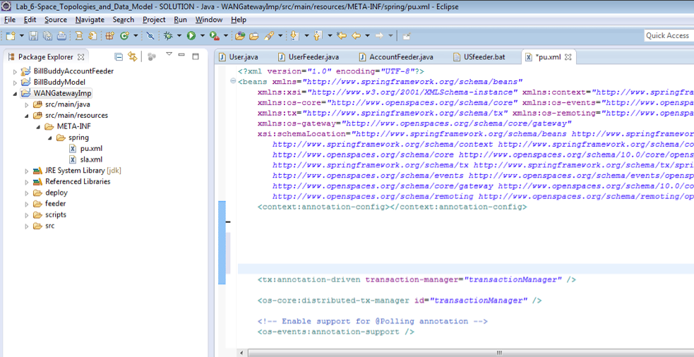
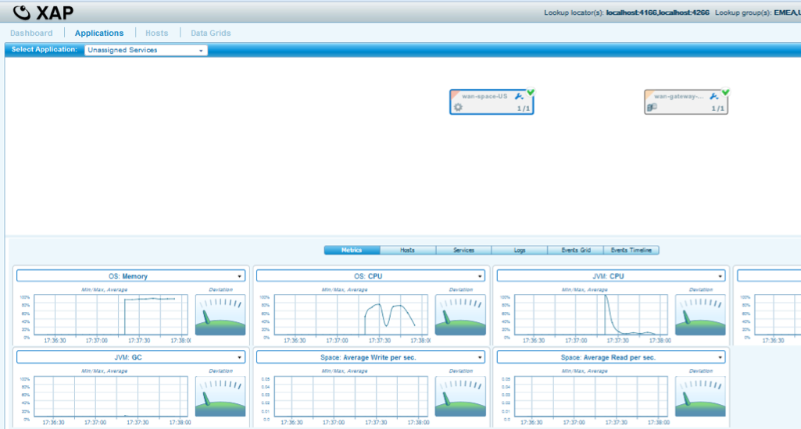
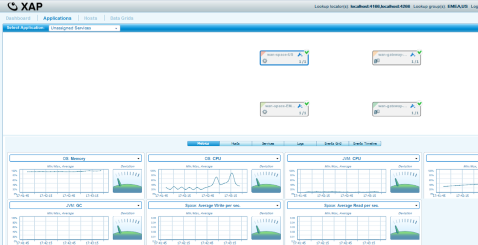

# lab4-solution - WAN Gateway Filter

## Lab Goals
Implement and configure the use of WAN Gateway Filter  

## Lab Description
During this lab you will deploy WAN Gateway Master to Master topology with Filter and examine it.  

## Lab setup
1.  Add GS_HOME system variable and point to Gigaspaces home directory:  
2.  Add export GS_WAN_TRAINING_HOME system variable and point to your WAN TRAINING directory:  

        vi ~/.bash_profile  
        export GS_HOME=~/XAP-Builds/gigaspaces-xap-enterprise-15.0.0
        export GS_WAN_TRAINING_HOME=~/XAPWANTraining
                               
3.  Make sure you restart gs-agent and gs-ui (or at least undeploy all Processing Units using gs-ui)
    
## 2.1	Clone and build the project lab

2.1.1 Open xap-wan-training project with intellij  

#### Notice the following 3 modules in Intellij: ####

#### WANGatewayFilterImpl #####
###### Implementation project for WAN Filter. Under deploy folder you will only see three (3) PU configurations. You will not see the
###### wan-space-US PU which will contain the filter and therefore is located under src/main/resources and src/main/java respectfuly.

#### BillBuddyModel #####
###### Defines all declarations that are required, in space side as well as the client application side.
###### This project should be deployed with all other projects since all other projects are dependent on the model.  

#### BillBuddyAccountFeeder #####
###### A client application (PU) that will be executed in Intellij. This application is responsible for writing Users and Merchants to the space.  

       
2.1.2 Run mvn install  

    yuval-pc:xap-wan-training yuval$ mvn install
    
    
       [INFO] ------------------------------------------------------------------------
       [INFO] Reactor Summary:
       [INFO] 
       [INFO] lab4-solution 1.0-SNAPSHOT ......................... SUCCESS [  0.490 s]
       [INFO] BillBuddyModel ..................................... SUCCESS [  3.582 s]
       [INFO] BillBuddyAccountFeeder ............................. SUCCESS [  2.098 s]
       [INFO] ReplicationFilter 1.0-SNAPSHOT ..................... SUCCESS [  0.921 s]
       [INFO] ------------------------------------------------------------------------
       [INFO] BUILD SUCCESS
       [INFO] ------------------------------------------------------------------------

    
## 2.2  Create WAN Filter Implementation

2.2.1	 Open project WANGatewayImp  
2.2.2	 Our Filter will control replication between US & EMEA.   
         The filter will replicate to EMEA user objects that meet the following conditions:  
         
1.	User was created in US  
2.	User.Continent = Europe  
 
2.2.3	Edit class ReplicationFilter and implement a process method 
        to filter from all Users created replicated to EMEA only those that have Continent attribute equals to “Europe”.  
a.	Fix TODO message in the object and implement process method.

  

2.2.4	Edit wan-space-US pu.xml located in src/main/java/META-INF  
 
a.	Fix TODO in the PU.xml to include package were filter is located  
b.	Fix TODO in the PU.xml fix os-core:space-replication-filter with your filter id name.  

  

2.2.5	Test your solution & validate that users created by US feeder are replicated to EMEA only if User.location equals to Continent.Europe  
a.	Go to folder scripts in project “WANGatewayFilterImpl”  
b.	Run /scripts/gs-webui.bat and wait for GS-WEBUI to start  
c.	Run /scripts/master-master-filter/cleanDeployFolder.bat that cleans any older deployments (Remember to do that any time you run your solution).    
d.	Start the US Zone Agent  - run scripts/master-master-filter/startAgent-US.bat  
e.	Start the HK Zone Agent  - run scripts/master-master-filter/startAgent-EMEA.bat  
f.	Validate that grid for both US & EMEA zone is up and running  

  

g.	Deploy the US deployment (wan-space-US & wan-gateway-US), Run scripts/master-master-filter/deployUS.bat  
h.	Validate the US Deployment  

  

i.	Deploy the EMEA deployment (wan-space-EMEA & wan-gateway-EMEA), Run scripts/master-master-filter/deployEMEA.bat  
j.	Validate the EMEA Deployment  

  

k.	Populate data into the US space – Run WANGatewayImp/feeder/USfeeder.bat  
l.	Validate only users with Continent.Eurpoe have been replicated into the EMEA space (wan-space-EMEA)  

  