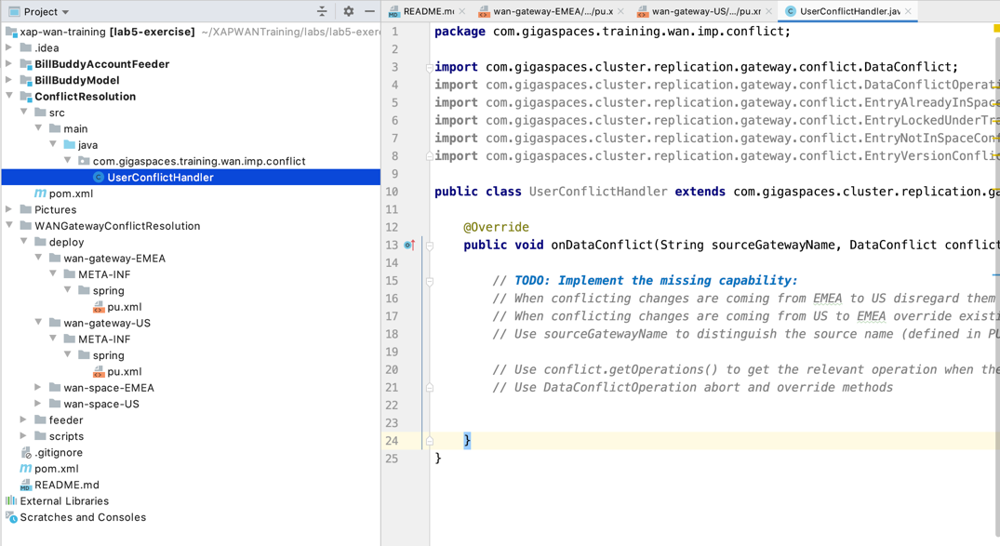
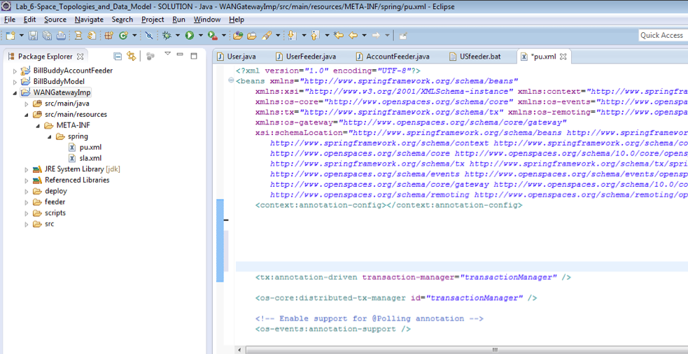
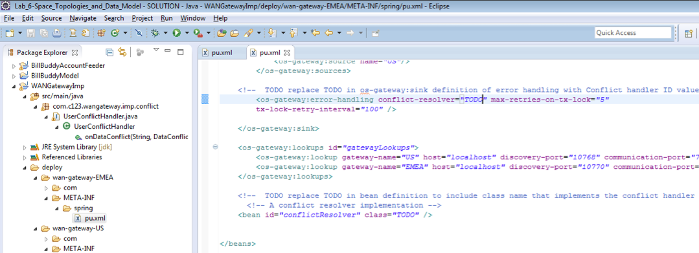
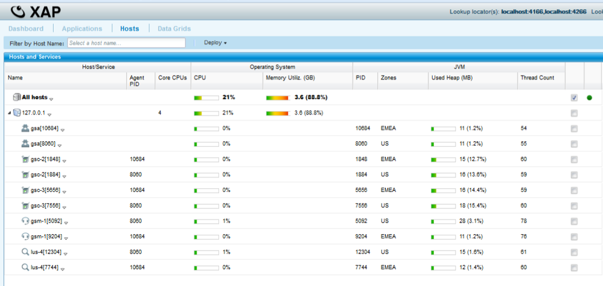
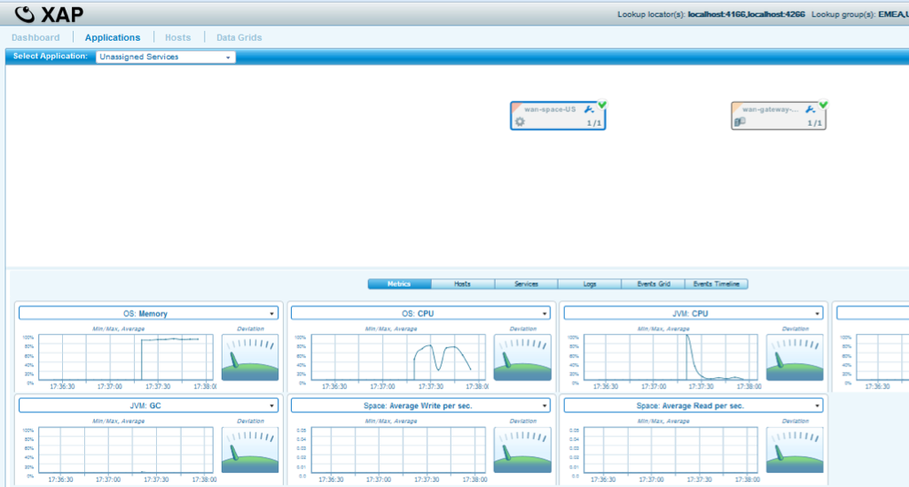
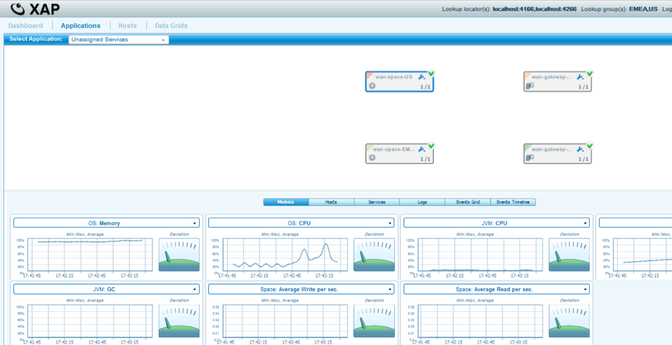
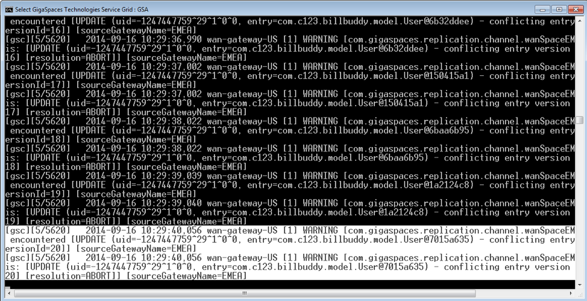
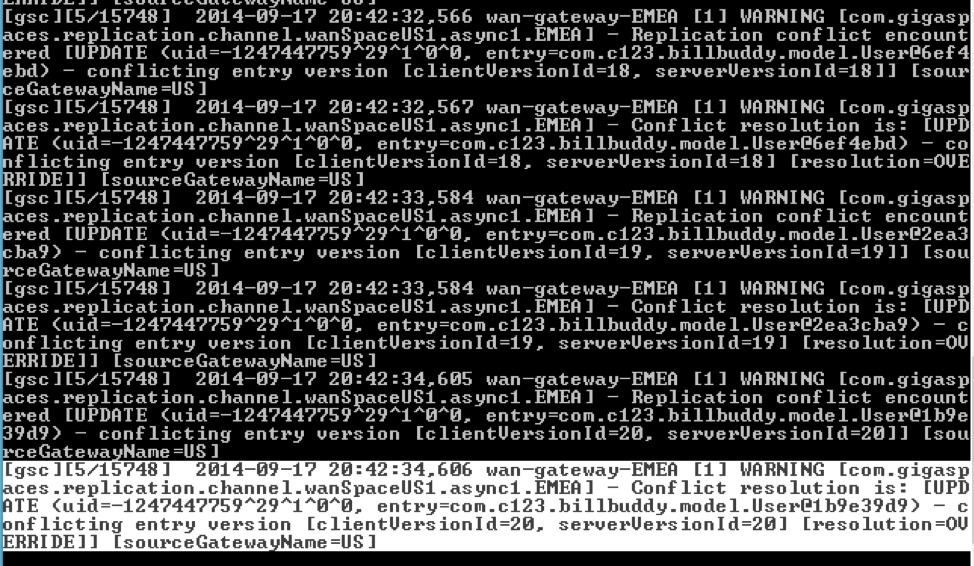
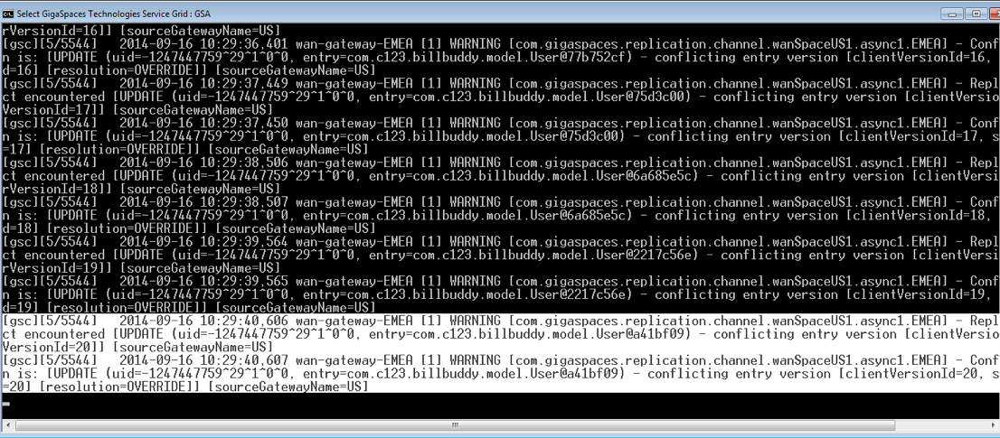

# lab5-exercise - WAN Gateway conflict resolution

## Lab Goals
1. Configure and develop conflict resolution handler  
2. Experience conflict resolution  

## Lab Description
During this lab you will deploy WAN Gateway Master to Master topology with conflict resolution implementation.  
The lab will simulate the following:  
1. Conflicts arriving from EMEA will be discarded.  
2. Conflicts arriving from US will be override EMEA (If override is supported).  

## Lab setup
1.  Add GS_HOME system variable and point to Gigaspaces home directory:  
2.  Add export GS_WAN_TRAINING_HOME system variable and point to your WAN TRAINING directory:  

        vi ~/.bash_profile  
        export GS_HOME=~/XAP-Builds/gigaspaces-xap-enterprise-15.0.0
        export GS_WAN_TRAINING_HOME=~/XAPWANTraining
                               
3.  Make sure you restart gs-agent and gs-ui (or at least undeploy all Processing Units using gs-ui)
    
## 2.1	Clone and build the project lab

2.1.1 Create lab directory

    mkdir ~/XAPWANTraining/labs/lab5-exercise
      
2.1.2 Clone the project from git
    
    cd ~/XAPWANTraining/labs/lab5-exercise
    git clone https://github.com/GigaSpaces-ProfessionalServices/xap-wan-training.git 
    
2.1.3 Checkout lab5-exercise
    
    cd xap-wan-training
    git checkout lab5-exercise
    
2.1.4 Verify that the branch has been checked out.
    
    git branch
    * lab5-exercise
      master 
    
2.1.5 Open xap-wan-training project with intellij  

#### Notice the following 3 modules in Intellij: ####

#### WANGatewayConflictResolution #####
###### Implementation project for WAN Conflict Resolution handler

#### BillBuddyModel #####
###### Defines all declarations that are required, in space side as well as the client application side.
###### This project should be deployed with all other projects since all other projects are dependent on the model.  

#### BillBuddyAccountFeeder #####
###### A client application (PU) that will be executed in Intellij. This application is responsible for writing Users and Merchants to the space.  

       
2.1.6 Run mvn install  

    yuval-pc:xap-wan-training yuval$ mvn install
    
    
     [INFO] ------------------------------------------------------------------------
     [INFO] Reactor Summary:
     [INFO] 
     [INFO] lab5-exercise 1.0-SNAPSHOT ......................... SUCCESS [  0.621 s]
     [INFO] BillBuddyModel ..................................... SUCCESS [  4.937 s]
     [INFO] BillBuddyAccountFeeder ............................. SUCCESS [  1.938 s]
     [INFO] ConflictResolution 1.0-SNAPSHOT ..................... SUCCESS [  0.853 s]
     [INFO] ------------------------------------------------------------------------
     [INFO] BUILD SUCCESS
     [INFO] ------------------------------------------------------------------------

    
## 2.2  WAN Gateway Conflict Resolution

2.2.1	 Open module ConflictResolution  
2.2.2	 Our conflict handler provide automated resolution when there are conflict between sites US & EMEA.           
2.2.3	Edit class UserConflictHandler and implement onDataConflict method that will be executed when there is conflict between entries.  
    a. Fix TODO message in the object and implement onDataConflict method.  

  

2.2.4	Edit US gateway pu.xml located in deploy/wan-gateway-US/META-INF/spring/pu.xml  
 
a.	Fix TODO in the PU.xml to include bean definition were conflict handler is located  
b.	Fix TODO in the PU.xml fix os-gateway:error-handling with your conflict resolution id name.  

  

2.2.5	Edit EMEA gateway pu.xml located in deploy/wan-gateway-EMEA/META-INF/spring/pu.xml  
 
a.	Fix TODO in the PU.xml to in bean definition include package were conflict handler is located.  
b.	Fix TODO in the PU.xml fix os-gateway:error-handling with your conflict resolution id name.  

  

2.2.5	Test your solution & validate that users created by US feeder are replicated to EMEA only if User.location equals to Continent.Europe  
a.	Go to folder scripts in “WANGatewayConflictResolution”  
b.	Run scripts/gs-webui.bat/sh and scripts/gs-ui.bat/sh  
c.	Run /scripts/master-master-conflict-res/cleanDeployFolder.bat/sh that cleans any older deployments (Remember to do that any time you run your solution).   
d.	Run /scripts/master-master-conflict-res/copyConflictHandler.bat/sh to copy the conflict handler class files to the deployment folder (Remember to do that any time you change your handler).    
e.	Start the US Zone Agent - run scripts/master-master-conflict-res/startAgent-US.bat/sh  
f.	Start the HK Zone Agent  - run scripts/master-master-conflict-res/startAgent-EMEA.bat/sh  
g.	Validate that grid for both US & EMEA zone is up and running  

  

h.	Deploy the US deployment (wan-space-US & wan-gateway-US), Run scripts/master-master-conflict-res/deployUS.bat/sh  
i.	Validate the US Deployment  

  

j.	Deploy the EMEA deployment (wan-space-EMEA & wan-gateway-EMEA), Run scripts/master-master-conflict-res/deployEMEA.bat/sh  
k.	Validate the EMEA Deployment  

  

l.	Populate data into the US space & EMEA space at the same time altering the same User record – Run WANGatewayConflictResolution/feeder/feeder.bat/sh  
m.	Examine GSA console for Conflict resolution messages  
    a.	US GS-Agent Console  
    b.	Check that incoming source is EMEA, check that resolution is abort (i.e. change from the EMEA site if there is a conflict is being discarded and from US resolution is OVERIDE).  

  
  

   c.   EMEA GS-Agent Console  
   d.	Check that incoming source is US, check that resolution is override (i.e. change from the US site if there is a conflict is overriding existing EMEA value).

  